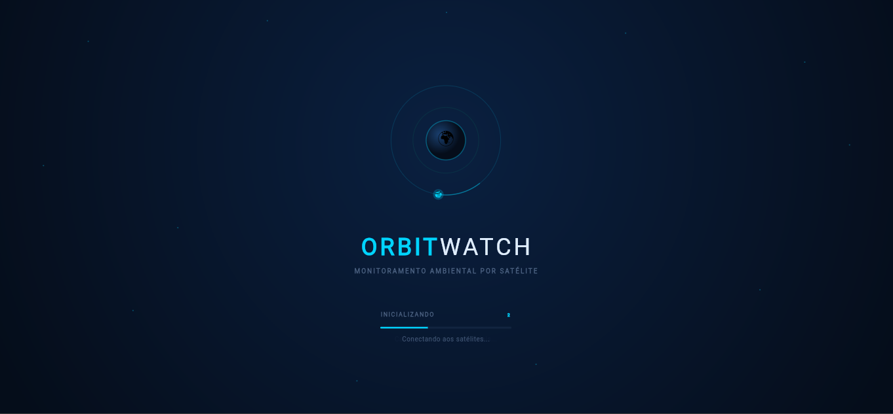
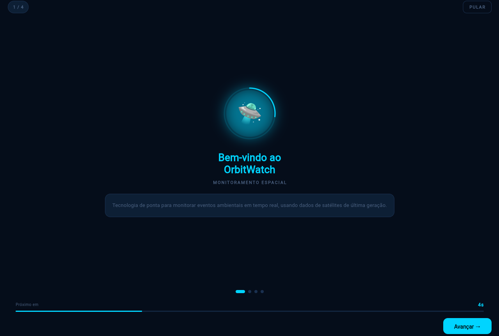
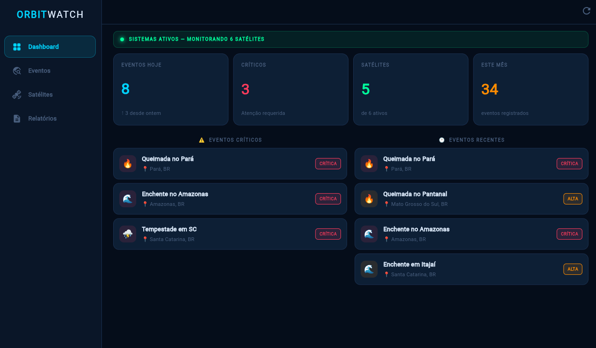
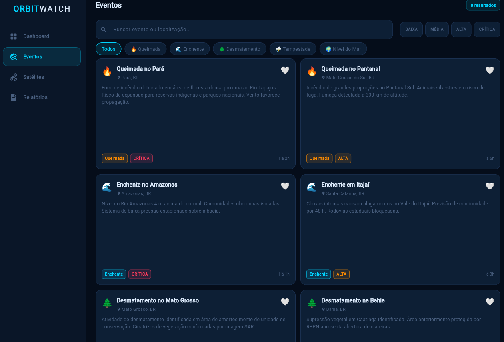
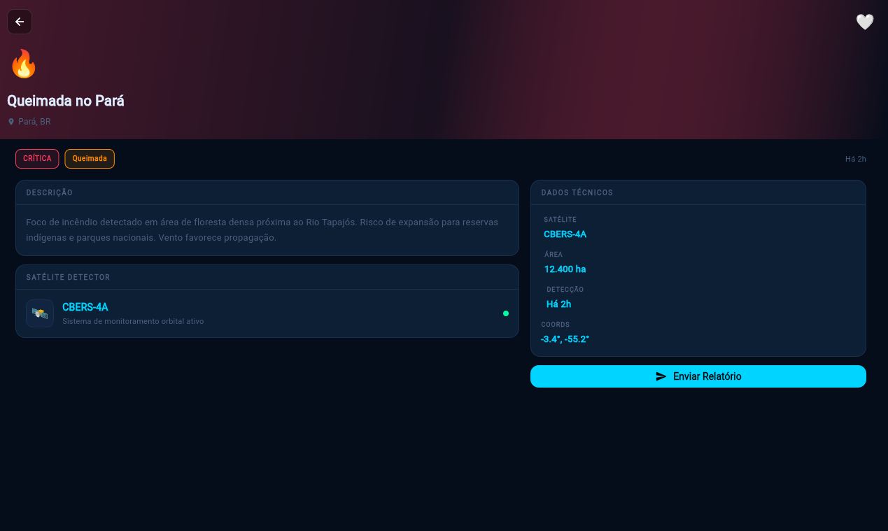
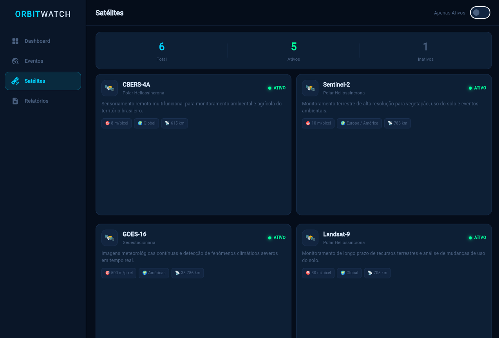
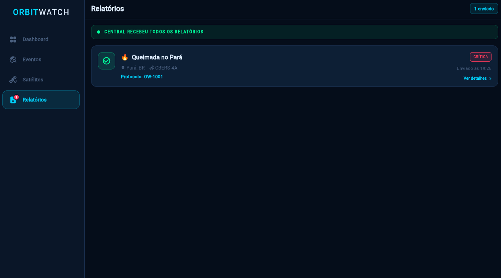
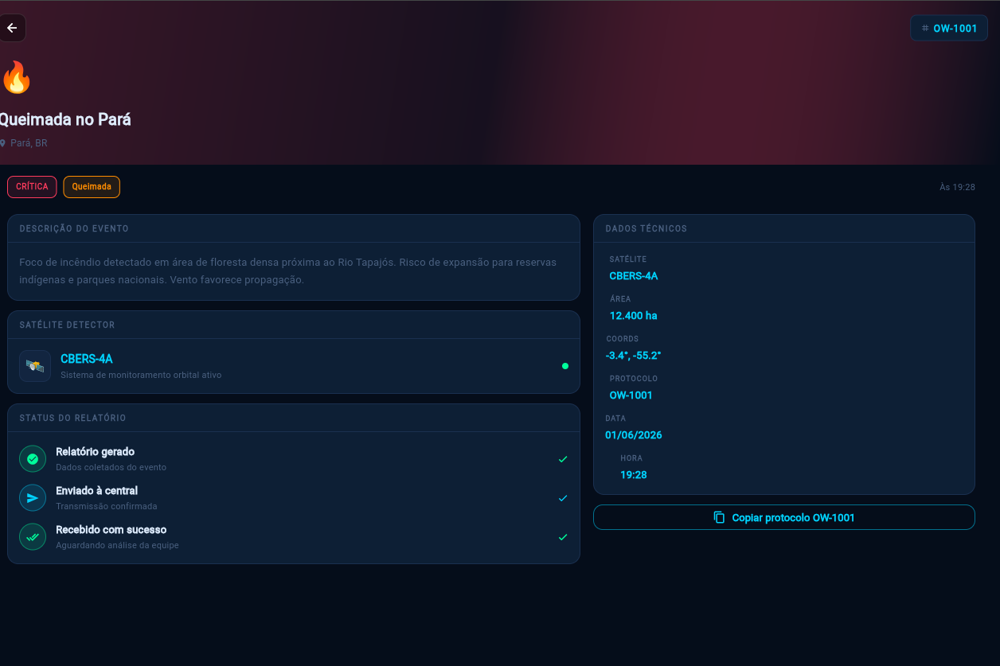

# 🛸 OrbitWatch — Monitoramento Ambiental por Satélite

> Aplicativo Flutter para monitoramento de eventos ambientais em tempo real, utilizando dados de satélites.

---

## Sobre o Projetoa

O **OrbitWatch** é um aplicativo mobile/desktop desenvolvido em Flutter que monitora eventos ambientais — queimadas, enchentes, desmatamentos, tempestades e variações do nível do mar — detectados poar satélites reais (CBERS-4A, Landsat-9, GOES-16, Sentinel-1, Sentinel-2, Jason-3).

O sistema permite que o usuário visualize eventos em tempo real, receba alertas por região, consulte informações dos satélites ativos e envie relatórios para uma central de monitoramento.


---

## Arquitetura

```
lib/
├── main.dart                  # Entry point + AppStateProvider (InheritedWidget)
├── theme.dart                 # Tema escuro (cores, tipografia, helpers)
├── models/
│   └── event_model.dart       # SatelliteEvent, SatelliteInfo, EnvironmentalAlert, enums
├── data/
│   ├── app_state.dart         # AppState (ChangeNotifier) + SentReport
│   └── mock_data.dart         # Dados simulados de eventos, satélites e alertas
└── screens/
    ├── splash_screen.dart     # Tela inicial animada (3 s)
    ├── intro_screen.dart      # Onboarding (4 slides com auto-avance)
    ├── home_screen.dart       # Shell de navegação (BottomNav / Rail lateral)
    ├── dashboard_screen.dart  # Painel principal com métricas e alertas
    ├── events_screen.dart     # Lista de eventos com filtros
    ├── event_detail_screen.dart # Detalhe do evento + envio de relatório
    ├── alerts_screen.dart     # Alertas ambientais por região
    ├── satellites_screen.dart # Catálogo de satélites
    ├── reports_screen.dart    # Relatórios enviados
    └── report_detail_screen.dart # Detalhe do relatório enviado
---

## Telas Detalhadas

### 1. Splash Screen
- Animação de órbita em loop contínuo (4s por ciclo)
- Contador regressivo: 3 → 2 → 1
- Barra de progresso linear (3s)
- Fade-in do logo "ORBITWATCH"
- Navega automaticamente para `/intro` após 3 segundos


---

### 2. Intro Screen (Onboarding)
4 slides com auto-avance a cada 5s (barra de progresso circular visível):

| Slide | Emoji | Título | Cor de Destaque |
|---|---|---|---|
| 1 | 🛸 | Bem-vindo ao OrbitWatch | Cyan |
| 2 | 🔥 | Detecção de Eventos | Laranja |
| 3 | 🚨 | Alertas Inteligentes | Vermelho |
| 4 | 🌿 | Impacto Ambiental | Verde |

- Indicadores de página (bolinhas)
- Botão "Avançar" / "Começar" (último slide)
- Swipe manual disponível



---

### 3. Dashboard Screen
Painel principal. Suporte a pull-to-refresh (simula 1.2s de loading).

**Seção: Métricas rápidas (cards)**
| Métrica | Valor |
|---|---|
| Total de Eventos | 8 |
| Eventos Críticos | 3 |
| Satélites Ativos | 5 |
| Alertas Hoje | 5 |
| Eventos no Mês | 34 |

**Seção: Alertas ativos**  
Exibe os alertas não lidos com badge de contagem. Toque expande a tela de Alertas.

**Seção: Eventos recentes**  
Lista os 4 eventos mais recentes com chip de severidade colorido. Toque navega para `EventDetailScreen`.

> Layout responsivo: em telas largas (> 700px), as métricas se reorganizam em grid 3 colunas.


---

### 4. Events Screen
Lista completa de eventos ambientais com filtros em tempo real.

**Filtros disponíveis:**
- **Busca textual** (título ou localização)
- **Tipo:** Queimada, Enchente, Desmatamento, Tempestade, Nível do Mar
- **Severidade:** Baixa, Média, Alta, Crítica

Cada card exibe:
- Ícone do tipo de evento
- Título e localização
- Badge de severidade com cor semântica
- Satélite detectante
- Tempo de detecção
- Indicador de favorito ❤️

**Paleta de severidade:**
| Severidade | Cor |
|---|---|
| Crítica | Vermelho `#FF4B4B` |
| Alta | Laranja `#FF8C42` |
| Média | Amarelo `#FFD166` |
| Baixa | Verde `#06D6A0` |



---

### 5. Event Detail Screen
Tela de detalhe completo de um evento.

**Informações exibidas:**
- Cabeçalho com tipo + severidade (cor de destaque)
- Título e localização
- Descrição completa
- Cards informativos: Satélite, Área afetada, Coordenadas, Detectado há X tempo

**Ações disponíveis:**
- **Favoritar** (ícone coração no AppBar) — persiste via `AppState`
- **Enviar Relatório** — abre diálogo de confirmação → gera `SentReport` com ID sequencial `OW-XXXX`
  - Se relatório já foi enviado, botão fica desativado com texto "Já Enviado"



---


### 6. Satellites Screen
Catálogo dos satélites cadastrados no sistema.

**Toggle:** "Apenas Ativos" (Switch)

**Satélites cadastrados:**
| Nome | Órbita | Resolução | Altitude | Status |
|---|---|---|---|---|
| CBERS-4A | Polar Heliossincrona | 8 m/pixel | 628 km | ✅ Ativo |
| Sentinel-2 | Polar Heliossincrona | 10 m/pixel | 786 km | ✅ Ativo |
| GOES-16 | Geoestacionária | 500 m/pixel | 35.786 km | ✅ Ativo |
| Landsat-9 | Polar Heliossincrona | 30 m/pixel | 705 km | ✅ Ativo |
| Jason-3 | Não-polar | — | 1.336 km | ❌ Inativo |
| Sentinel-1 | Polar Heliossincrona | 5 m/pixel | 693 km | ✅ Ativo |

Cada card exibe cobertura, propósito e indicador de status colorido.



---

### 7. Reports Screen
Lista dos relatórios enviados pelo usuário (vazia no início).

- Estado vazio: mensagem ilustrada "Nenhum relatório enviado"
- Com relatórios: lista com ID (`OW-XXXX`), data, tipo de evento e severidade
- Badge no ícone da aba mostra quantidade de relatórios
- Toque navega para `ReportDetailScreen`



---

### 8. Report Detail Screen
Detalhe completo do relatório enviado.

**Informações:**
- ID do relatório (`OW-XXXX`)
- Data e hora de envio
- Evento de origem (título, localização, coordenadas)
- Satélite detectante
- Área afetada
- Severidade com chip colorido
- Descrição completa do evento



---

## Gerenciamento de Estado

O estado global é gerenciado via **`AppState` (ChangeNotifier)** distribuído pela árvore de widgets com um **`AppStateProvider` (InheritedWidget)**.

```
OrbitWatchApp (StatefulWidget)
└── AppStateProvider (InheritedWidget)
    └── MaterialApp
        └── qualquer tela
            └── AppStateProvider.of(context) → AppState
```

**Métodos públicos do AppState:**
| Método | Efeito |
|---|---|
| `toggleFavorite(id)` | Alterna favorito de um evento |
| `toggleAlertRead(id)` | Alterna status de leitura de um alerta |
| `markAllAlertsRead()` | Marca todos os alertas como lidos |
| `sendReport(event)` | Cria e registra um `SentReport` |
| `hasReport(eventId)` | Verifica se relatório já foi enviado |

---

*OrbitWatch — Global Solution 2026 · Flutter*


